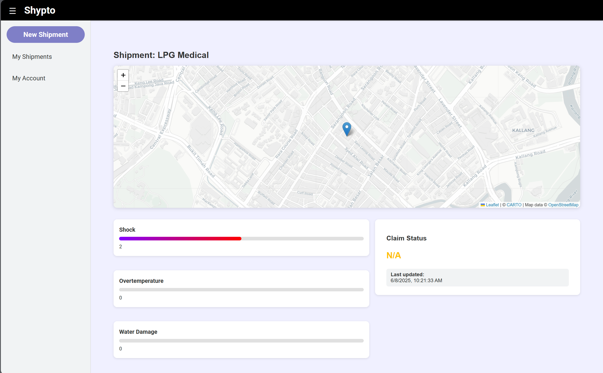
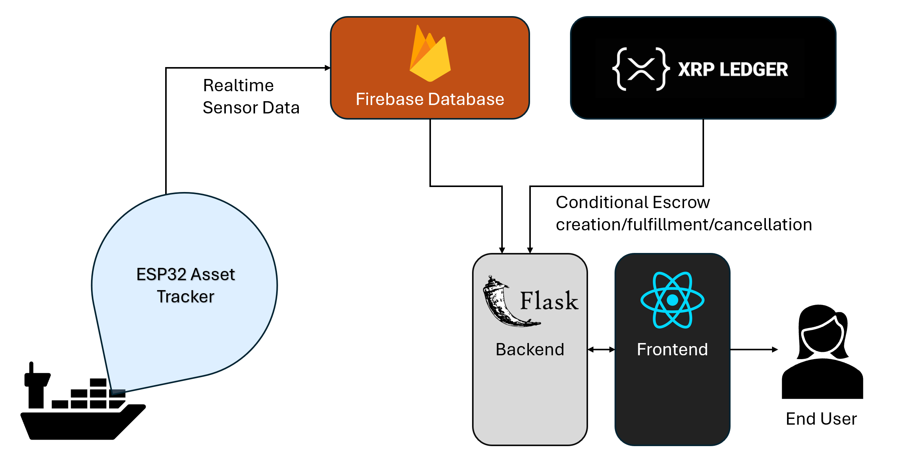
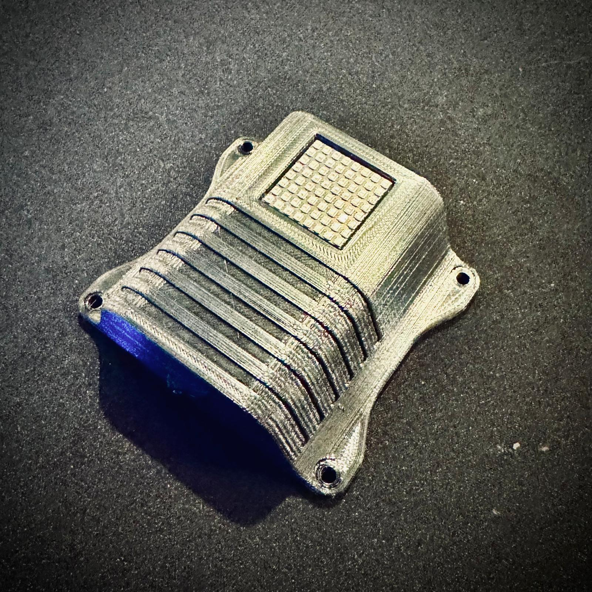

# Shypto — IoT-Powered Microinsurance on the XRP Ledger

**Shypto** provides automated, condition-based cargo insurance for global shipments using real-time sensor tracking and decentralized finance. It leverages the XRP Ledger to enable fast, secure, and programmable insurance payouts—especially for high-risk or high-value goods.

## Demo Video:

---

## Problem Statement

Global logistics face billions in annual losses due to **damaged, spoiled, or lost cargo**, especially in sectors like medicine, food, and electronics. Traditional insurance options are slow, opaque, and not cost-effective for small exporters or high-risk items. Shypto automates microinsurance with blockchain escrow and IoT-driven condition monitoring, reducing cost and friction for both insurers and shippers.

---

## Tech Stack

| Layer             | Technology                            |
|------------------|----------------------------------------|
| Frontend         | React                   |
| Backend          | Python Flask REST API                  |
| Blockchain       | XRP Ledger / xrpl-py                   |
| Authentication   | Firebase Auth                          |
| Database         | Firebase Realtime Database             |
| IoT Device       | ESP32 (C++ / ESP-IDF / FreeRTOS)        |

---

## System Diagram

## Features

- **Cryptographic Insurance**: Conditional escrows powered by `EscrowCreate` and `Preimage-SHA256`.
- **Real-Time Cargo Monitoring**: IoT sensors stream shock, temperature, and humidity data to Firebase.
- **Automatic Claim Triggers**: Escrows are fulfilled if sensor conditions are violated.
- **Live Dashboard**: Shipment health, location, and claim status are viewable in a React frontend.
- **Investor Pooling (optional)**: Underwriters can escrow payouts and receive premiums based on outcomes. This allows for securitization/pooling/tokenization of insurance pools.

---

## Custom Asset Tracker

Shypto uses a hardware asset tracker for real-time container monitoring and conditional escrow handling. When the sensor detects damage beyond a defined threshold (water, heat, shock), the escrow is automatically fulfilled and the container owner receives an insurance payout.

Presentation slides : https://www.canva.com/design/DAGpuYCu6Es/g6o1CBNDLxWLKiG-xjhJug/edit?utm_content=DAGpuYCu6Es&utm_campaign=designshare&utm_medium=link2&utm_source=sharebutton

Twitter thread : https://x.com/om_anavekar/status/1931527220075676082
